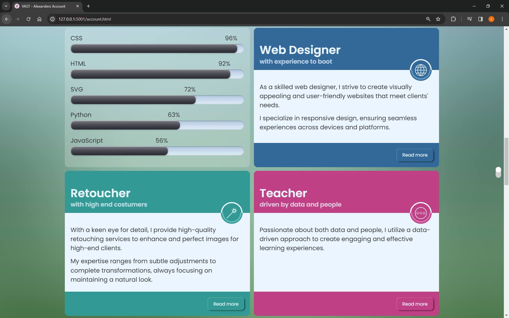
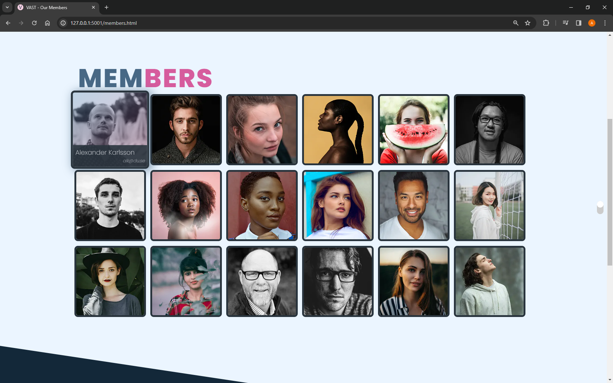
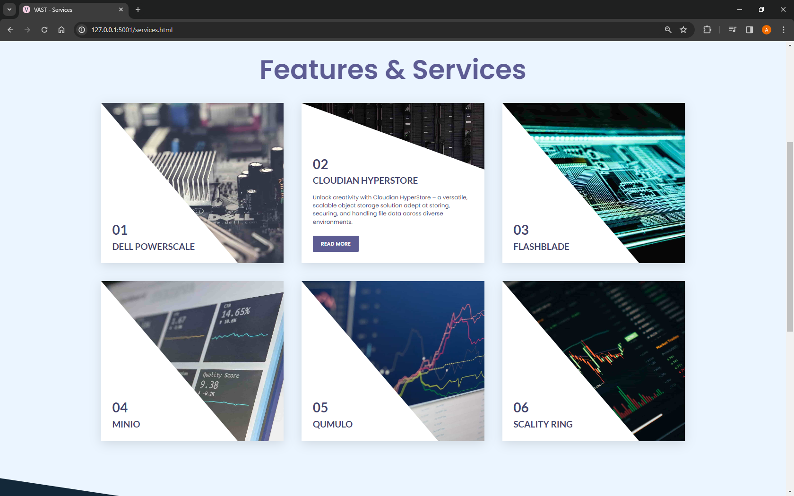

# Group project made in college in a course called Responsive Web Design

The project consist of a responsive website made with the HTML and CSS (utility classes) skeleton provided by the teacher where me and my college friends where each responsible for certain component.

**_The site has a toggle button that enables a preview of how the site has to look and how we made it look trying to achieve an exact replica._**

* Me (Adrian): Responsible for making an entire new component called services.html with cards within it that has to be totally reusable.
* Louise: Responsible for the account.html component by making the cards responsive and match the exact replica to the teachers design.
* Elange: Responsible for the members.html component by making the images responsive and match the exact replica to the teachers design. 

**_More information for the requisites about each component below:_**

# Card Component (account.html)
The card component is the simplest among all components and should be completed
relatively quickly. Prioritize completing it promptly and then help you fellow team
members.

Adhere to the videos, generic rules and following “Rules for the Card Component” to
ensure all requirements are met.
### Rules for the Card Component:
* A designated CSS file named card.css for the card component is already
present in the styles/components directory. Utilize this file for all styling
related to the card component except the placement of the whole component
on the page and the margin around it. This should as previously mentioned be
the responsibility of the existing grid system.
* The card component must adjust its position in the layout to align with the
provided reference.
* The visual design of the card component should closely replicate that of the
card component in the reference.
* Use the icons located in the img/informative/icons directory for the top right
corner of each card.
* To accurately position these icons on the card, employ the following CSS
properties:

```css
position: absolute;
position: relative;
transform: translate(?); or alternatively, translate: ?;
```

The text found within the cards must be the same as in the reference. Below is
the text to be used:

- _As a skilled web designer, I strive to create visually appealing and
user-friendly websites that meet clients' needs. I specialize in
responsive design, ensuring seamless experiences across devices and
platforms._

 - _With a keen eye for detail, I provide high-quality retouching services to
enhance and perfect images for high-end clients. My expertise ranges
from subtle adjustments to complete transformations, always focusing
on maintaining a natural look._

- _Passionate about both data and people, I utilize a data-driven
approach to create engaging and effective learning experiences._

When naming and structuring your card component, you must use either BEM
(Block Element Modifier) or CSS-Nesting. Adhere to the following guidelines
based on your choice:

* If you opt for BEM, ensure you strictly follow the BEM naming
conventions, focusing on clarity and reusability as per the principles
of component-driven design.</p>

* If you choose CSS-Nesting, you may forego BEM conventions. However,
it's crucial to apply CSS-Nesting correctly throughout the entire card
component.



# Thumbnail Component (members.html)
The thumbnail component is complex and will necessitate the use of CSS properties
that manage visual effects and stacking contexts. The student responsible for this
task will need to conduct web research to identify and apply some necessary
properties. Despite its complexity, the thumbnail component is expected to be less
challenging than the “unknown” component, which needs to be developed for the
services page. Once you complete the thumbnail component, you should assist with
the “unknown” component.

Adhere to the videos, generic rules and following “Rules for the Thumbnail
Component” to ensure all requirements are met.

### Rules for the Thumbnail Component:
* A designated CSS file named thumbnail.css for the card component is already
present in the styles/components directory. Utilize this file for all styling
related to the thumbnail component except the placement of the whole
component on the page and the margin around it. This should as previously
mentioned be the responsibility of the existing grid system.
* The card component must adjust its position in the layout to align with the
provided reference.
* The visual design of the card component should closely replicate that of the
card component in the reference.
* The hover state demonstrated in the reference for screen widths of 768px and
above must be functional for all thumbnails starting from a screen width of
768px.
* All images used in the thumbnails must be responsive and informative. The
lecture on responsive images covered several key concepts, which should be
applied to the images within the thumbnails:
o Bare minimum requirements
o Aspect ratio considerations
o Backup solutions
o Width switching techniques
o Control over image layout
o Media conditions
o Multiple media conditions
o Default settings for unmet conditions
o Art direction and/or file format support
o Alignment with CSS layout rules (the must match with the existing grid)
* To display the thumbnails on the page, you need to utilize the member.js file.
Within this file, correctly insert the HTML for a single thumbnail inside the
designated function displayed below:
```javascript
function memberThumbnail(member) {
const thumbnail = `
<div class="col-12">
<p>id: ${member.id}</p>

</div>
`;
return thumbnail;
}
```
* Replace the yellow text in the example above with your html, the
above is just an example to make you see how the html and content is
implemented.
* To get different names and images to show up you just replace static
text with these: ${member.first_name} replacing first_name with
whatever you’ll need from this list: id, eid, first_name, last_name,
gender, mail. Then save the member.js and see the result.



# Unknown Component (services.html)
This task is the most challenging of the three. The student is required to create an
additional webpage named services.html. This page should mirror the structure and
design of the site header, main section, and site footer, consistent with the other
pages on the site. Additionally, functional navigation links to and from services.html
should be integrated into the site's navigation bar. However, these are just the
foundational requirements.

Further, the content within the main element of services.html should consist of one
or more new component of higher complexity. The layout and content inside this
main section should be informed by research on typical structures and contents of
service pages.

Moreover, the placement of these components must utilize the existing grid system,
ensuring that the design of the services.html page cohesively integrates with the
overall website design. The student must develop the components using CSS that
employs the most modern standards and practices whenever possible.

This task is indeed challenging. The  other two students should aim to complete their
respective tasks promptly, so they can assist in completing this task. Given the task's
complexity and time demands, the first student assigned to it should be self-reliant.

Adhere to the videos, generic rules and following “Rules for the Unknown
Component” to ensure all requirements are met.
### Rules for the Unknown Component
* The services.html page must share the same site-header, navigation, main,
and site-footer as other pages on the VAST website. The site-footer will
automatically appear when you include a main element and add the following
scripts just before the closing body tag:
```javascript
<script src="./js/navbar.js"></script>
<script src="./js/footer.js"></script>
<script src="./js/modal.js"></script>
```
* Ensure the main element on services.html is empty before adding your
custom content.
* Update the navigation links on all webpages so that the “Services” link directs
to services.html, and ensure services.html has links to access the other
webpages on the website.
* The structure, layout, design, and content inside the main element of
services.html must be informed by research on service pages from other
similar companies (note that VAST deals with data storage).
* Use the existing grid system for placing content outside the components.
* For colors and gradients, utilize existing custom properties as much as
possible.
* Name the component logically and generically, reflecting its potential uses in
other projects. Store it in the components folder. Use this file for all styling
related to the component, except for its overall placement on the page and its
margin, which should be managed by the existing grid system, as previously
mentioned.
* The component must be created using modern CSS practices, with CSS-nesting
being an absolute requisite.


